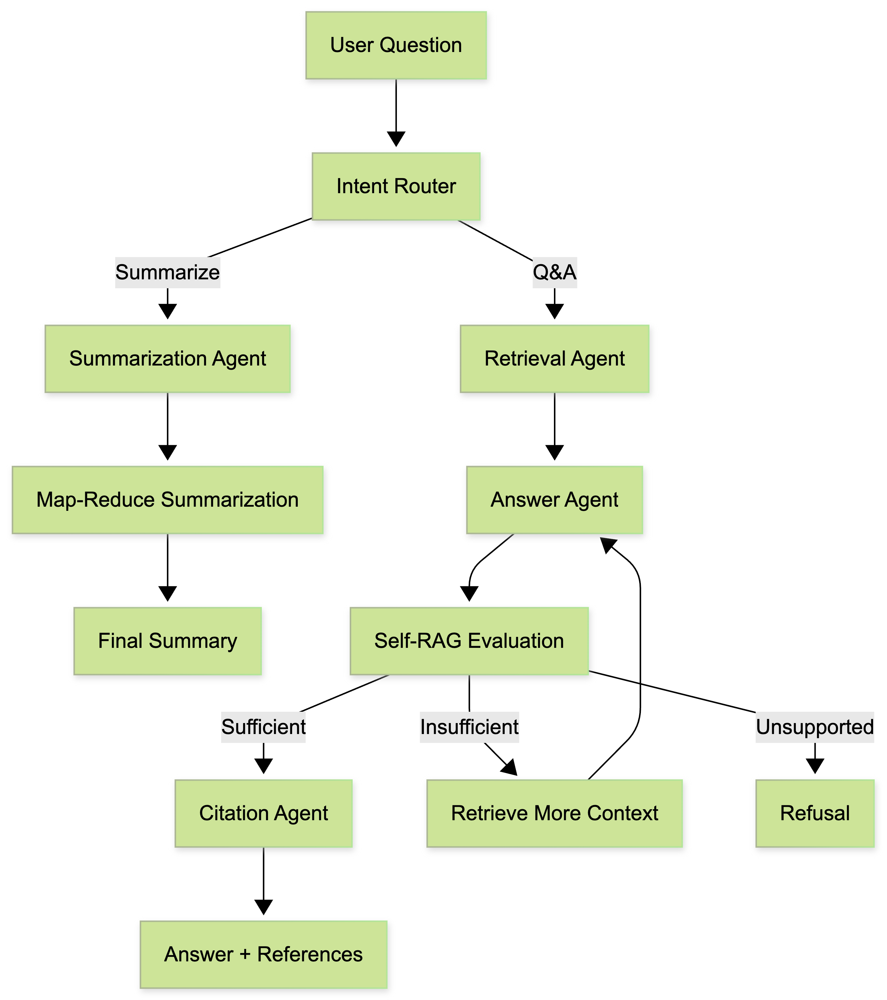

# 📄 Agentic Document Q&A & Summarization System (LangGraph + Self-RAG)

## Overview

This project implements an **agentic AI system** for document understanding that supports:

- **Document-grounded Question Answering (RAG)**
- **Safe long-document summarization**
- **Self-RAG (self-evaluating retrieval loops)** for improved factual reliability
- **Automatic knowledge refresh** when documents change
- **Explicit agent orchestration using LangGraph**

The system guarantees that answers are generated **only from the provided documents** and explicitly refuses to answer when sufficient information is not available.

---

## Key Features

### Retrieval-Augmented Question Answering (RAG)
- Semantic retrieval using FAISS vector store
- Answers generated strictly from retrieved document chunks
- Citations provided for traceability
- Explicit refusal for out-of-scope queries

### Self-RAG for Answer Reliability
- The agent evaluates whether an answer is sufficiently grounded
- Decides to:
  - Accept the answer
  - Retrieve additional context
  - Refuse when unsupported
- Bounded retry logic prevents infinite loops

### Safe Document Summarization
- Hierarchical map–reduce summarization strategy
- Handles long documents without exceeding LLM context limits
- Uses only document content (no external knowledge)

### Automatic Knowledge Refresh
- Document changes detected using SHA-256 hashing
- Vector store rebuilt automatically when content changes
- Prevents stale embeddings and outdated answers

### Multi-Format Document Support
- PDF (`.pdf`)
- Plain text (`.txt`)
- Word documents (`.docx`)

---

## System Architecture



## Create Environment and Install Dependenices 

```

conda create -n qa_dev python=3.10
conda activate qa_dev

pip install -r requirements.txt

```

## Create a .env file in the project root:

```OPENAI_API_KEY=sk-xxxxxxxxxxxxxxxx```

## Running the Application

1. Place a document inside the `documents/` folder  
   (Supported formats: `.pdf`, `.txt`, `.docx`)

2. Update `DOCUMENT_PATH` in `config.py`

```python
DOCUMENT_PATH = "documents/example.pdf"

```

3. Run the main application

``` 
python main.py

```

4. You will see the interactive prompt - 

``` 
Ask a question (type 'exit'):

```
